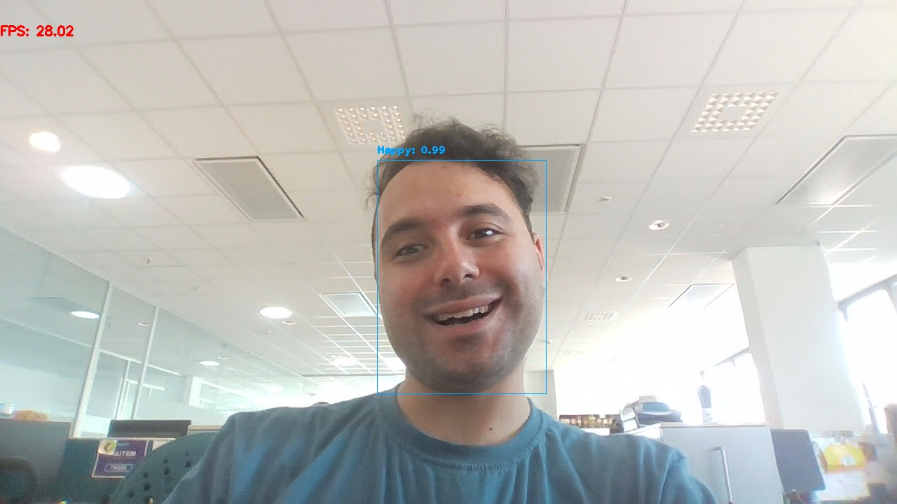
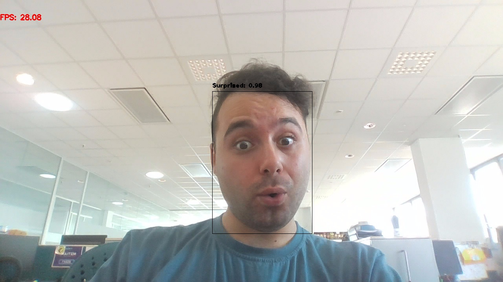
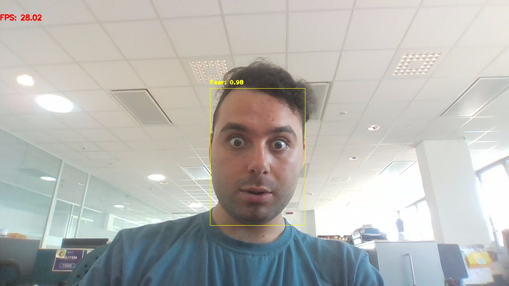
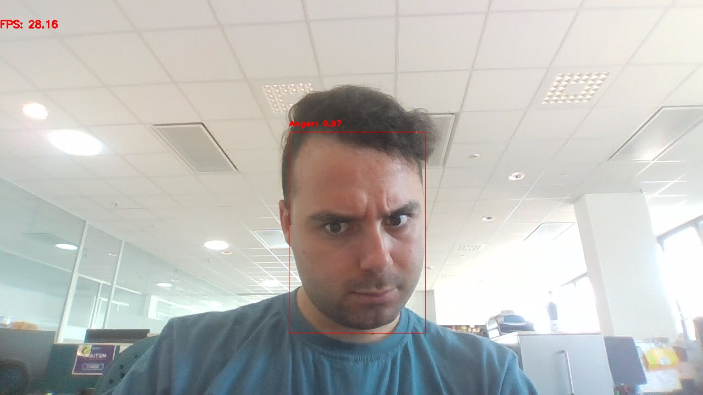

# Emotion Detection

Real-time emotion detection using the YOLOv10l model. This project utilizes OpenCV and a custom-trained YOLO model to detect and classify emotions in a live video stream from a webcam. The application includes a graphical user interface for controlling the detection process and capturing images with detected emotions.

## Features

- **Real-Time Detection**: Detects emotions in real-time from a live webcam feed.
- **Bounding Boxes**: Displays bounding boxes with class names and confidence scores.
- **Class-Specific Colors**: Uses different colors for each emotion class.
- **Image Capture**: Capture images with detected emotions and save them locally.
- **User Interface**: Simple GUI to start/stop detection and capture photos.

## Performance

Here are some example screenshots demonstrating the performance of the system:


### Detecting Emotion With Bounding Boxes and Confidence Scores






## Installation

1. **Clone the repository:**
   ```bash
   https://github.com/Amirhossein-khabbazi/Real_time_emotion_detection.git
   cd emotion-detection
   ```
2. **Install the required packages:**

   ```bash
   pip install -r requirements.txt
   ```
3. **Download the fine-tuned YOLO model from following repository and place it in the models/ directory:**
   ```bash
   https://www.kaggle.com/models/amirhoseynkkhabbazi/yolo10l-emotion-detection
   ```

## Usage
**Run the application:**
```bash
python src/main.py
```

## Dataset
**The data set can be avaiable on:**
   ```bash
   https://www.kaggle.com/datasets/amirhoseynkkhabbazi/emotion-detection
   ```


   
